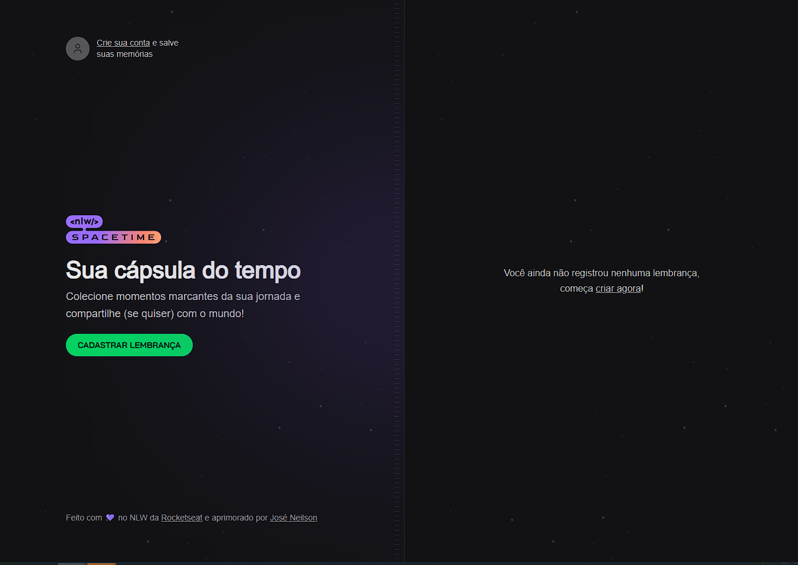
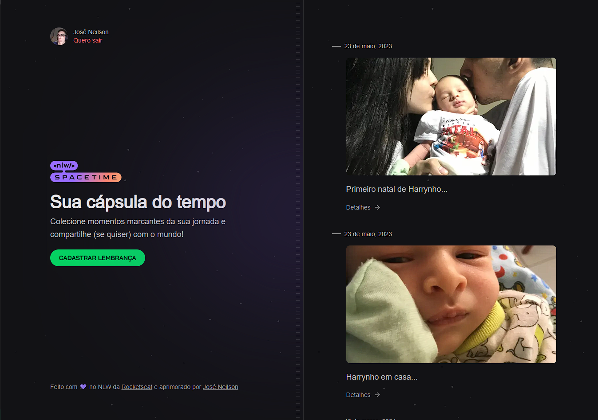
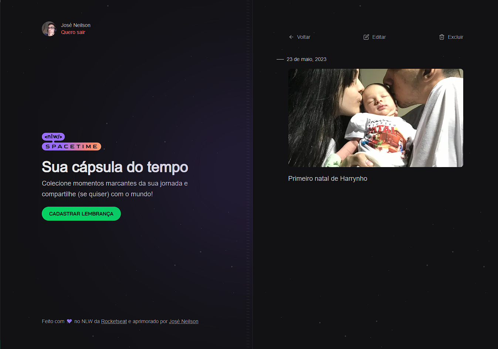
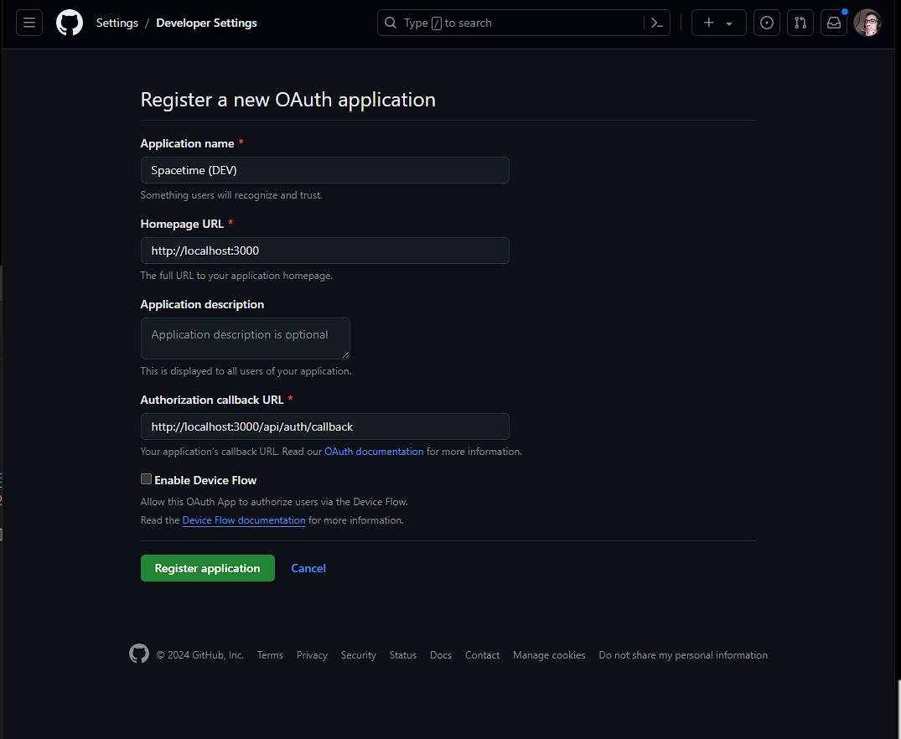
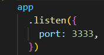
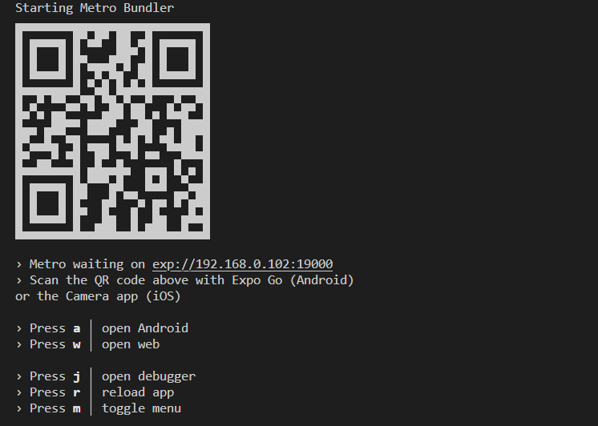
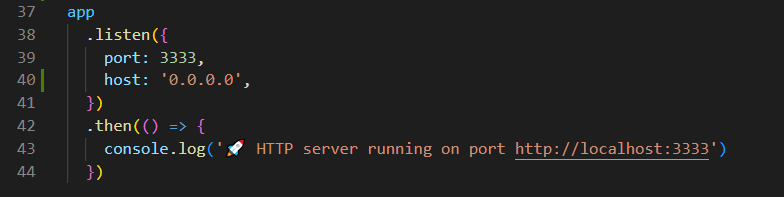

# Rede Social 

A rede social surgiu a partir de um bootcamp da rocketseat o NLW Space Time, onde fizemos um create e um read de memorias. Ao finalizar o bootcamp o instrutor Diego Fernandes da aula deu alguns desafios, tais como finalizar o CRUD e tornar a memória como publica, para todos que fizerem cadastro na plataforma possam visualizar. Eu concluí os desafios, mas acredito que a aplicação pode ir mais longe, daí estou adicionando mais funcionalidades a plataforma, tais como enviar várias imagens na postagem, título e descrição da postagem, comentários nas postagens, perfil pessoal e entre várias outras novas features que irei ir adicionando.

## Imagens do sistema

## Home


## Home com Login


## Detalhes


## Gerando chaves de autenticação no Github
Logado em seu Github acesse https://github.com/settings/developers
Crie um novo OAuth Apps.
Gere o OAuth dessa forma.

A chave Client ID já vem pronta. gere uma nova chave secreta clicando em Generate a new client secret.


## Executando Front-end
```sh
npm install
npm run dev
```
Acesse http://localhost:3000 para visualizar a aplicação no front.
## Executando Back-end na versão web

```sh
npm install
npm run dev
```
A aplicação server roda na porta http://localhost:3333.

## Executando Mobile
Baixe as dependências e rode o projeto.
```sh
npm install
npm run start
```
 <br />
E escolha a plataforma de sua preferencia para rodar a aplicação.

## Executando Back-end na versão Mobile
 <br />
Adicione a linha     
```sh
host: '0.0.0.0',
```

Na função app.listen no arquivo server.ts dentro da pasta src
```sh
app
  .listen({
    port: 3333,
    host: '0.0.0.0',
  })
```

Baixe as dependências e rode o projeto.
```sh
npm install
npm run dev
```
